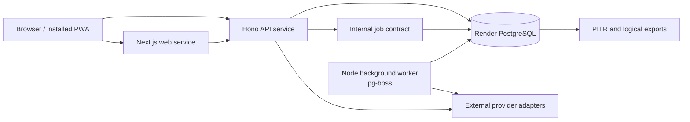

# Architecture decisions

This directory records consequential platform decisions for Roavia. Linear remains the source of truth for task state; these documents describe durable technical constraints rather than duplicating issue progress.

## Decision register

| ADR                                                         | Decision                                                           | Status           | Decision owner       | Review trigger                                                                                      |
| ----------------------------------------------------------- | ------------------------------------------------------------------ | ---------------- | -------------------- | --------------------------------------------------------------------------------------------------- |
| [0001](./decisions/0001-mvp-deployment-topology.md)         | Use Render for the MVP web, API, worker, and PostgreSQL topology   | Accepted for MVP | Roavia product owner | Production provisioning, a material pricing change, or a required region Render does not support    |
| [0002](./decisions/0002-postgres-background-jobs.md)        | Use `pg-boss` on PostgreSQL behind an internal job contract        | Accepted for MVP | Platform owner       | Queue load materially harms transactional traffic or workflow requirements exceed job semantics     |
| [0003](./decisions/0003-provider-integration-boundaries.md) | Isolate external providers behind normalized server-side contracts | Accepted for MVP | Platform owner       | A provider cannot satisfy the normalized contract without leaking vendor behavior into product code |
| [0004](./decisions/0004-supabase-auth.md)                   | Use Supabase Auth with SSR cookies and asymmetric JWT verification | Accepted for MVP | Product owner        | Residency requirements change or provider reliability, cost, or identity features no longer fit     |

## MVP topology

The web, API, worker, and database run in one product-approved Render region. The browser never receives database, job-runtime, AI, or external-provider credentials. The API and worker use internal database networking; only the web and API expose public application endpoints.

## Acceptance coverage

| Requirement                   | Recorded decision                                                                                                  |
| ----------------------------- | ------------------------------------------------------------------------------------------------------------------ |
| Next.js and Hono hosting      | Separate Node web services on Render; independent health checks and scaling                                        |
| PostgreSQL                    | Paid Render PostgreSQL, private connection path, Drizzle migrations, point-in-time recovery                        |
| Scheduled and background jobs | A continuously running worker uses `pg-boss` schedules, retries, and dead-letter queues                            |
| Secrets                       | Environment-scoped Render secrets, least-privilege service assignment, no client-prefixed secret values            |
| Logs and operational signals  | Structured redacted logs, Render metrics and failure notifications, optional OpenTelemetry-compatible export       |
| Rollback                      | Render artifact rollback for services; expand/contract database migrations and forward recovery for schema changes |
| Cost and local development    | Four-resource production floor, no separate queue datastore, local Node and PostgreSQL parity                      |
| Scaling and lock-in           | Independent service scaling, explicit extraction thresholds, standard Node/PostgreSQL interfaces                   |
| Provider isolation            | Normalized contracts in existing packages; provider code and credentials stay in server-only adapter paths         |

## Product approval gates

The architecture is implementable without deciding these inputs, but production provisioning or provider commitments must not proceed until the named owner records them in Linear.

| Input required                                                                     | Owner                      | Needed before                             | Default if still undecided                                               |
| ---------------------------------------------------------------------------------- | -------------------------- | ----------------------------------------- | ------------------------------------------------------------------------ |
| Launch audience and permitted data region                                          | Product and privacy owner  | Creating production data stores           | Stop; do not assume a region for precise trip data                       |
| Monthly infrastructure ceiling and Render workspace tier                           | Product owner              | WDL-55 production sizing                  | Price one instance per service plus paid PostgreSQL; previews remain off |
| Recovery objectives and whether PostgreSQL high availability is required at launch | Product and platform owner | WDL-55 release approval                   | Paid PITR baseline, no HA claim                                          |
| Log, metric, and audit retention requirements                                      | Privacy and platform owner | Connecting an external observability sink | Use platform retention and redact sensitive fields                       |
| Launch destinations, languages, and provider budget                                | Product owner              | Selecting concrete travel-data providers  | Curated fixtures and provider fakes only                                 |
| Offline map/media licensing requirements                                           | Product and legal owner    | Shipping downloadable map or media assets | Exclude unlicensed provider assets from offline packages                 |
| Supabase project region for account data                                           | Product and privacy owner  | Provisioning production authentication    | Stop; do not provision until the approved residency region is recorded   |
| Assistant and precise trip-history retention                                       | Product and privacy owner  | Persisting production assistant content   | Store the minimum operational metadata only                              |

## Architecture review against the PRD

- Reliability: every job has a durable idempotency key, bounded retry policy, dead-letter path, and operator-visible failure record.
- Privacy: precise dates, locations, and assistant content are excluded from logs and job payloads unless strictly necessary; retained payloads use identifiers wherever possible.
- Credentials: provider, database, auth-admin, and AI secrets stay in API or worker runtime scopes.
- Grounding: provider results preserve source, freshness, license, and retrieval metadata through normalization.
- User control: background or live-provider work can propose itinerary changes but cannot persist them without the product's explicit confirmation path.
- Recovery: service rollback is independent from database recovery; destructive schema rollback is never implied by a code rollback.
