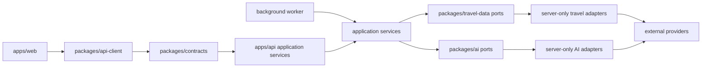

# ADR 0003: Provider integration boundaries

- Status: Accepted for MVP
- Date: 2026-07-27
- Decision owner: Platform owner
- Reversibility: High; concrete providers are selected at server composition roots

## Context

Roavia depends on AI, maps, routing, geocoding, weather, climate, events, holidays, currency, advisories, destination content, media, and identity providers. Coverage, freshness, licensing, cost, failure modes, and data sensitivity differ by provider. The PRD requires source-aware data and prohibits silent itinerary mutation from live recommendations.

Product and UI code must not inherit provider response shapes, credentials, SDK types, or error semantics. Provider selection remains a separate product and research decision.

## Decision

All external services are accessed through normalized internal contracts owned by existing server-side packages. Concrete adapters are selected at the API and worker composition roots from validated server configuration.

### Package responsibilities

| Location                                         | May contain                                                                             | Must not contain                                                |
| ------------------------------------------------ | --------------------------------------------------------------------------------------- | --------------------------------------------------------------- |
| `packages/contracts`                             | Transport-safe request, response, and event schemas                                     | Provider SDK or provider response types                         |
| `packages/api-client`                            | Typed calls to the Hono API                                                             | Provider credentials or direct provider calls                   |
| `packages/travel-data` root exports              | Normalized travel-data ports, values, source and freshness types, error taxonomy        | A concrete provider selected as the default                     |
| `packages/travel-data` server-only adapter paths | Provider SDK mapping, pagination, rate-limit translation, provider-specific cache keys  | Browser exports or product decisions                            |
| `packages/ai` root exports                       | Provider-neutral generation, validation, repair, evaluation, model capability contracts | Unvalidated provider output                                     |
| `packages/ai` server-only adapter paths          | AI provider SDK calls and normalized usage metadata                                     | Client imports or persistence policy                            |
| API and worker composition roots                 | Adapter selection, secret resolution, fallback policy, circuit breakers                 | Provider response shapes crossing the application boundary      |
| `packages/offline` and `packages/ui`             | Normalized, licensed, freshness-aware data only                                         | Provider SDKs, secrets, or provider-specific rendering branches |

Package exports and lint rules added by implementation issues must make server-only adapter paths impossible to import from `apps/web`.

## Normalized contracts

Each provider operation defines input and output schemas independent of a vendor. Successful data includes:

- normalized domain values and units;
- stable internal place or trip references where available;
- source URL or official source identifier;
- provider identity for audit, never for product branching;
- retrieval, publication, validity, and expiry times as available;
- license and redistribution or offline-use constraints;
- coverage locale or region;
- quality, confidence, and warning metadata with documented semantics;
- normalized usage and cost units when the provider exposes them.

The shared error taxonomy distinguishes timeout, unavailable, rate-limited, quota-exhausted, unauthorized, invalid request, not found, unsupported coverage, invalid response, license-restricted, and internal failure. Adapters preserve a redacted provider error code for operations without leaking provider exceptions through the API.

## Adapter rules

- Validate provider responses before normalization and validate normalized outputs before returning them.
- Convert units, time zones, locale identifiers, coordinates, and date boundaries explicitly. Never infer freshness from request time alone.
- Preserve source and licensing metadata through persistence, API responses, AI grounding, and offline packaging.
- Apply timeouts, bounded retries, concurrency limits, quota budgets, and circuit breakers outside domain logic.
- Cache only through a declared freshness policy keyed by provider, operation, normalized input, locale, and policy version.
- A provider adapter does not write domain tables, mutate itineraries, authorize users, or render UI. Application services own those decisions.
- Store provider identifiers only as reconciliation metadata. Internal IDs remain canonical.
- Do not claim fallback equivalence unless both providers satisfy the same contract, coverage, license, and freshness policy.

## Sensitive data and credentials

- Keep secret credentials in API or worker runtime scope. A browser-visible map token, if a chosen provider requires one, must be separately restricted by origin, capability, and quota and is never treated as a server credential.
- Minimize outbound trip context. Send only the location, date range, preferences, or text required for the operation.
- Do not include user identity, share tokens, unrelated itinerary details, or full assistant history in provider requests.
- Structured telemetry records provider, operation, latency, status, quota, cache outcome, and normalized error. It excludes raw coordinates, exact travel dates, prompts, responses, and user free text by default.
- Provider payload retention requires an explicit purpose, access policy, and expiry. Prefer normalized values plus source references.
- Provider terms, data-processing terms, training-use policy, region, deletion support, and offline redistribution rights are approval gates before production use.

## Provider selection and fallback

Selection is capability based. A registry receives validated configuration and returns an adapter implementing the required port. Domain code requests an operation such as route estimation or weather forecast; it never names a vendor.

Fallback is configured per operation:

1. Check whether the primary provider supports the region, locale, and freshness requirement.
2. Apply cache policy and circuit-breaker state.
3. On an allowed transient or unsupported-coverage result, try an approved fallback only if licensing and normalized semantics remain valid.
4. Preserve every source used and expose partial or stale status explicitly.
5. When no safe fallback exists, return a typed unavailable or stale result. Never fabricate data or silently downgrade a high-stakes official source.

Visa, safety, emergency, and travel-advisory operations link to approved official sources and do not fall back to generative inference.

## AI-specific boundary

- The AI adapter returns schema-constrained candidates plus model, latency, token, cost, finish, and safety metadata.
- Retrieval, business validation, repair, grounding checks, and persistence remain in provider-neutral orchestration.
- Persist an itinerary only after shared schema and business validation. Invalid or unsupported claims are repaired, rejected, or shown with uncertainty.
- Model or provider switches must not change the transport contract or bypass evaluations.
- Provider calls may propose actions; only an application service with explicit user confirmation can apply an itinerary change.

## Tests and verification

Every adapter requires contract fixtures for success, partial data, invalid shape, timeout, rate limit, quota exhaustion, stale data, unsupported coverage, and provider outage. Tests verify unit and time-zone normalization, source and license preservation, redaction, deterministic cache keys, fallback order, and that provider exceptions do not cross the port.

Provider-neutral orchestration tests run against fakes. A small opt-in integration suite may call sandbox providers with non-production credentials; it must not use real trip data and must remain outside the default offline test path.

## Open product inputs

Concrete provider selection remains blocked on:

- launch destinations, languages, and required regional coverage;
- map display, geocoding, routing, and offline map licensing needs;
- weather forecast horizon and historical climate requirements;
- event, holiday, currency, advisory, destination-content, and media licensing requirements;
- AI quality, latency, safety, data-use, residency, and budget thresholds;
- authentication and account-data residency requirements;
- approved monthly and per-generation provider budgets;
- fallback expectations for each user-facing capability.

Until those inputs are approved, implementation uses normalized interfaces, deterministic fixtures, and explicit provider-unavailable states rather than assuming vendors.

## Consequences

- Adding a provider requires adapter and contract tests but does not change pages, transport schemas, or domain services.
- Normalization adds implementation work and may intentionally hide vendor-only features until the internal contract adopts them.
- Source, freshness, and license metadata become mandatory data rather than optional presentation fields.
- Provider fallback is explicit product policy, not an incidental SDK retry.
